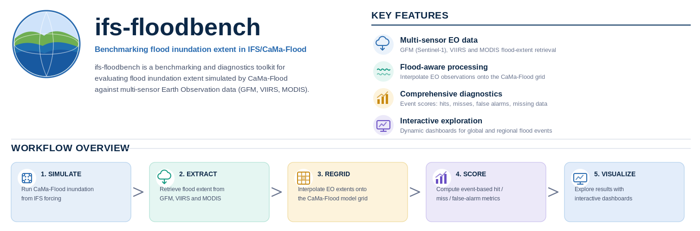

# ifs-floodbench

`ifs-floodbench` helps you compare IFS/CaMa-Flood inundation extent against multi-sensor Earth Observation data (GFM, VIIRS, MODIS) and produce interactive HTML dashboards.

At a high level, you run a pipeline that:
1. simulates flood inundation extent with CaMa-Flood;
2. extracts flood extent from EO sources (GFM, VIIRS, MODIS);
3. regrids the EO observations onto the (coarser) CaMa-Flood grid;
4. computes benchmark scores (CSI, FAR, Hit Rate) per event and threshold;
5. builds an interactive dashboard to compare model and observations.

## Quick Start

If you are new to the workflow, follow these exact steps first.

### 1) Go to a large permanent directory

Your `$PERM` directory if available, or set `PERM` to any permanent directory of your choice.

```bash
cd $PERM
```

### 2) Clone the repository

```bash
git clone git@github.com:gpbalsamo/ifs-floodbench.git
cd ifs-floodbench
```

### 3) Create the Conda environment

```bash
module load conda            # on ECMWF HPC; otherwise ensure conda/mamba is available
conda env create -f Scripts/modis_flood.yml
conda activate modis_flood
```

VIIRS/GFM fetching additionally needs the [`atlantis`](https://github.com/opageo/atlantis) CLI set up separately (its own `uv`/`pixi` environment, plus a NASA Earthdata token — see atlantis's own README). `atlantis` originated as the [ECMWF Code for Earth](https://github.com/ECMWFCode4Earth/atlantis/) project for extracting and harmonising EO satellite flood/water products, and is what `ifs-floodbench` uses to retrieve VIIRS and GFM (and, where possible, MODIS). The MODIS extraction script also needs an Earthdata token:

```bash
export EARTHDATA_TOKEN="YOUR_TOKEN_HERE"
```

`plot_kurosiwo_flood_cases.py` (the CaMa-Flood layer) uses ECMWF Metview and MARS, so it only runs on ECMWF systems with access to those.

### 4) Try the worked example: edit an event catalogue and rebuild its dashboard

See [Editing the event catalogue](#editing-the-event-catalogue--worked-example-2026) below for a full walkthrough using `DEflood2026_events.csv`, the catalogue of ongoing/recent 2026 flood events.

### 5) Upload a dashboard (optional)

```bash
export ECMWF_FLOODBENCH_TOKEN="<set securely outside Git>"
python3 Scripts/upload_dashboard.py --dashboard-dirname de2026-dashboard
```

---

## Repository Structure

```text
ifs-floodbench/
├── Notebooks/            Python notebooks for exploratory flood-event analysis
├── Scripts/              Command-line workflow: extract, plot, benchmark, dashboard
├── kurosiwo-dashboard/    Generated: KuroSiwo benchmark dashboard (gitignored)
├── modis2016-dashboard/   Generated: post-2016 named-events dashboard (gitignored)
├── de2026-dashboard/      Generated: recent/ongoing 2026 events dashboard (gitignored)
├── KuroSiwo_events.csv    Event catalogue: curated, fully-scored KuroSiwo benchmark
├── Modis2016_events.csv   Event catalogue: hand-picked named events since 2016
└── DEflood2026_events.csv Event catalogue: ongoing/recent events tracked for 2026
```

Generated observation/model caches (`kurosiwo_observations/`, `de2026_observations/`, `cama_png/`, `de2026_png/`, `modis_events/`, ...) and the three dashboard directories are gitignored — only the catalogue CSVs, `Scripts/`, and the notebooks are committed. See [Generated files and Git](#generated-files-and-git).

---

## Notebooks

Exploratory, single-case notebooks (as opposed to the batch Scripts/ workflow below):

* **`Rivers-Inundation-Forecast.ipynb`** — visualise flood events from CaMa-Flood (CMF) model outputs (1, 3, 6, 15 arcmin resolutions).
* **`Extract_GFM_Inundation.ipynb`** — extract flood extent from Sentinel-1 GFM (~20 m).
* **`Extract_VIIRS_Inundation.ipynb`** — extract flood extent from VIIRS (~375 m).
* **`Bench_CMF_GFM_Inundation.ipynb`** / **`Bench_CMF_VIIRS_Inundation.ipynb`** — benchmark CaMa-Flood against GFM/VIIRS. The model grid is the interpolation target, since model and EO resolutions differ substantially.

Use a consistent `flood_case` name and `area` definition across notebooks for the same event.

---

## Three dashboards

`ifs-floodbench` builds three separate dashboards from three separate event catalogues, sharing the same Leaflet/PapaParse UI (`Scripts/dashboard_shell.py`) and cross-linking to each other:

| Dashboard | Catalogue | Layers | Benchmark scores |
|---|---|---|---|
| **KuroSiwo benchmark** (`kurosiwo-dashboard/`) | `KuroSiwo_events.csv` | CaMa-Flood, VIIRS, GFM, MODIS | Yes (CSI/FAR/HR) |
| **Post-2016 named events** (`modis2016-dashboard/`) | `Modis2016_events.csv` | CaMa-Flood, MODIS | No |
| **Recent/ongoing 2026 events** (`de2026-dashboard/`) | `DEflood2026_events.csv` | CaMa-Flood, VIIRS, GFM, MODIS | Yes (CSI/FAR/HR) |

Live examples:

```text
https://sites.ecmwf.int/pad/floodbench/kurosiwo-dashboard/
https://sites.ecmwf.int/pad/floodbench/modis2016-dashboard/
https://sites.ecmwf.int/pad/floodbench/de2026-dashboard/
```

The KuroSiwo catalogue is deliberately kept as the curated, fully-scored benchmark; new/ongoing events go into `DEflood2026_events.csv` instead, which is why that's the catalogue used for the worked example below.

---

## Editing the event catalogue — worked example (2026)

`DEflood2026_events.csv` is the catalogue of ongoing/recent events for the `de2026-dashboard`. It uses the same KuroSiwo-style columns as the other catalogues (see `Scripts/README.md` → "Required catalogue format"):

```text
flood_case, country, continent, date_start, date_end,
lat_min, lat_max, lon_min, lon_max,
max_flood_extent_km2, date_of_max_flood_extent, main_river_system
```

### 1) Add a new event row

Append a row to `DEflood2026_events.csv`, e.g. for a new event:

```csv
Elbe_Floods,Germany,Europe,20260801,20260815,50.5,53.8,9.0,14.8,0,20260808,Elbe
```

`date_start`/`date_end`/`date_of_max_flood_extent` must already be in the past — the pipeline extracts already-observed EO imagery (MODIS/VIIRS/GFM), so a future date has nothing to fetch yet. `max_flood_extent_km2` can be left as `0` — it isn't used by the pipeline below, only `date_of_max_flood_extent` and the bounding box are.

### 2) Fetch VIIRS/GFM observations for the new event

```bash
python3 Scripts/fetch_kurosiwo_observations.py \
  --csv DEflood2026_events.csv --outroot de2026_observations \
  --source viirs,gfm --window-days 3 --max-tile-deg 5.0 --skip-existing
```

`--skip-existing` means already-processed events are left alone, so only the new row is fetched.

### 3) Retrieve the CaMa-Flood layer

```bash
python3 Scripts/plot_kurosiwo_flood_cases.py \
  --csv DEflood2026_events.csv --outdir de2026_png \
  --overlay-dir de2026_png/layers --expver j01b
```

Note `--expver j01b`: this catalogue needs a CaMa-Flood experiment that actually reaches these (recent) dates — KuroSiwo/Modis2016's default `j1ee` does not.

### 4) Extract MODIS for the new event

MODIS here does **not** go through atlantis (its near-real-time backend only covers the last ~1 week, and its historical backend needs an HDF4-capable GDAL atlantis's venv lacks) — run `extract_modis_flood.py` directly in the `modis_flood` conda env, once per event:

```bash
conda activate modis_flood
python3 Scripts/extract_modis_flood.py --date <peak date> \
  --area <lat_max> <lon_min> <lat_min> <lon_max> \
  --composite F2 --source laads --outdir de2026_events/<flood_case>
```

### 5) Compute benchmark scores

```bash
python3 Scripts/compute_flood_scores.py --csv DEflood2026_events.csv \
  --cama-grib-dir de2026_png --atlantis-root de2026_observations \
  --modis-dir de2026_events --out de2026_scores.csv
```

### 6) Rebuild the dashboard manifest and shell

```bash
python3 Scripts/build_dashboard_manifest.py --csv DEflood2026_events.csv \
  --cama-dir de2026_png/layers --atlantis-root de2026_observations \
  --modis-dir de2026_events --scores-csv de2026_scores.csv \
  --dashboard-data de2026-dashboard/dashboard_data

python3 Scripts/de2026_dashboard.py
cp DEflood2026_events.csv de2026-dashboard/dashboard_data/
```

### 7) View it locally

```bash
cd de2026-dashboard
python3 -m http.server 8002
```

Then open:

```text
http://localhost:8002/
```

The new event now appears in the event list and on the map, with CaMa-Flood/VIIRS/GFM/MODIS layers and CSI/FAR/HR scores like every other event in the catalogue.

The same pattern (add a row → re-run the pipeline with `--skip-existing`) applies to `KuroSiwo_events.csv` + `kurosiwo-dashboard` and `Modis2016_events.csv` + `modis2016-dashboard`; see `Scripts/README.md` → "Recommended workflows" for their exact command sequences.

---

## Scripts reference

`Scripts/` contains the full command-line workflow. Highlights:

```text
extract_modis_flood.py            Extract a single MODIS MCDWD composite for a date/area
modis_flood_events.py             Batch MODIS extraction+plotting over a catalogue
estimate_modis_peak_dates*.py     Pick the best-observed date per event (cloud-aware)
gapfill_modis_flood.py            Temporal gap-filling of MODIS time series
plot_kurosiwo_flood_cases.py      IFS/CaMa-Flood flood-fraction + discharge maps (Metview/MARS)
fetch_kurosiwo_observations.py    Batch VIIRS/GFM/MODIS fetch via atlantis
compute_flood_scores.py           CSI / FAR / Hit-Rate per event, source, threshold
build_dashboard_manifest.py       Assemble the multi-layer dashboard manifest (layers.json)
kurosiwo_dashboard.py             Build the KuroSiwo benchmark dashboard shell
modis2016_dashboard.py            Build the post-2016 named-events dashboard shell
de2026_dashboard.py               Build the recent/ongoing 2026 events dashboard shell
add_country_continent.py          Fill in country/continent from a catalogue's bounding boxes
upload_dashboard.py               Upload a dashboard bundle to ECMWF Sites
```

Full documentation, arguments, and worked pipelines for all three dashboards: **`Scripts/README.md`**.

---

## Upload dashboards to ECMWF Sites

Set your ECMWF Sites API token (e.g. in `~/.profile`):

```bash
export ECMWF_FLOODBENCH_TOKEN="<set securely outside Git>"
```

Upload one of the three dashboard directories recursively:

```bash
python3 Scripts/upload_dashboard.py --dashboard-dirname kurosiwo-dashboard
python3 Scripts/upload_dashboard.py --dashboard-dirname modis2016-dashboard
python3 Scripts/upload_dashboard.py --dashboard-dirname de2026-dashboard
```

Dry run:

```bash
python3 Scripts/upload_dashboard.py --dashboard-dirname de2026-dashboard --dry-run
```

Useful options:

```text
--workflow-dir          Directory containing the dashboard directories. Default: /perm/$USER/ifs-floodbench
--dashboard-dirname     kurosiwo-dashboard, modis2016-dashboard, or de2026-dashboard (required)
--remote-dashboard-dir  Remote path to upload into. Default: same name as --dashboard-dirname
--space                 ECMWF Sites space. Default: $USER
--site-name             ECMWF Sites name. Default: floodbench
--list-before           List remote files before upload
--list-after            List remote files after upload
--dry-run               Print actions without uploading
```

The upload script reads the token from `ECMWF_FLOODBENCH_TOKEN`. Do not hard-code API tokens in the repository.

---

## Generated files and Git

Generated dashboard and observation-cache outputs are gitignored and should not normally be committed:

```text
kurosiwo-dashboard/
modis2016-dashboard/
de2026-dashboard/
kurosiwo_observations/
modis2016_observations/
de2026_observations/
cama_png/
de2026_png/
modis_events/
modis2016_events/
de2026_events/
__pycache__/
*.pyc
```

Commit the catalogue CSVs, notebooks, and `Scripts/`, not the generated dashboard/cache outputs.

---

## Requirements

Typical dependencies (pinned in `Scripts/modis_flood.yml`):

```text
python=3.11
numpy
rasterio
requests
shapely
matplotlib
gdal
hdf4
libgdal-hdf4
```

Plus, for the notebooks and CaMa-Flood layers:

```text
xarray
metview
odc-stac (for EO data access)
```

Additional requirements:

* [`atlantis`](https://github.com/opageo/atlantis) — separate environment, used for VIIRS/GFM/MODIS fetching (`fetch_kurosiwo_observations.py`); originally the [ECMWF Code for Earth atlantis project](https://github.com/ECMWFCode4Earth/atlantis/).
* NASA Earthdata token (`EARTHDATA_TOKEN`) — for MODIS extraction.
* ECMWF Metview + MARS access — for `plot_kurosiwo_flood_cases.py` (ECMWF systems only).
* `sitesctl` CLI (`module load sites`) — for `upload_dashboard.py` only.

---

## Methodological Background

The general benchmarking framework is described in:

* A benchmarking framework for flood models using EO data: https://agupubs.onlinelibrary.wiley.com/doi/full/10.1029/2024MS004379

---

## Authors

Gianpaolo Balsamo
Calum Baugh
Kenka Tazi
Andreas Grafberger
Yannis Kalfas
Stelios Lagaras
ECMWF

---

## Future Work

* Extension to additional EO datasets
* Improved harmonisation across spatial resolutions
* Gap filling for EO missing data (persistence, precipitation-screening)
* Integration with Earth System Model workflows

---

## Copyright and License

(C) Copyright 2026- ECMWF.

This software is licensed under the terms of the Apache License Version 2.0
which can be obtained at http://www.apache.org/licenses/LICENSE-2.0.

In applying this licence, ECMWF does not waive the privileges and immunities granted to it by
virtue of its status as an intergovernmental organisation nor does it submit to any jurisdiction.

---
